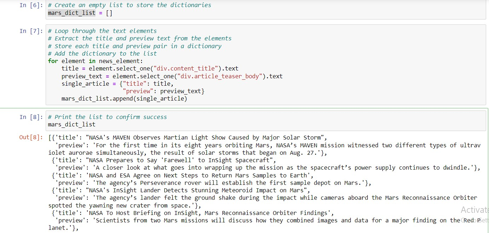
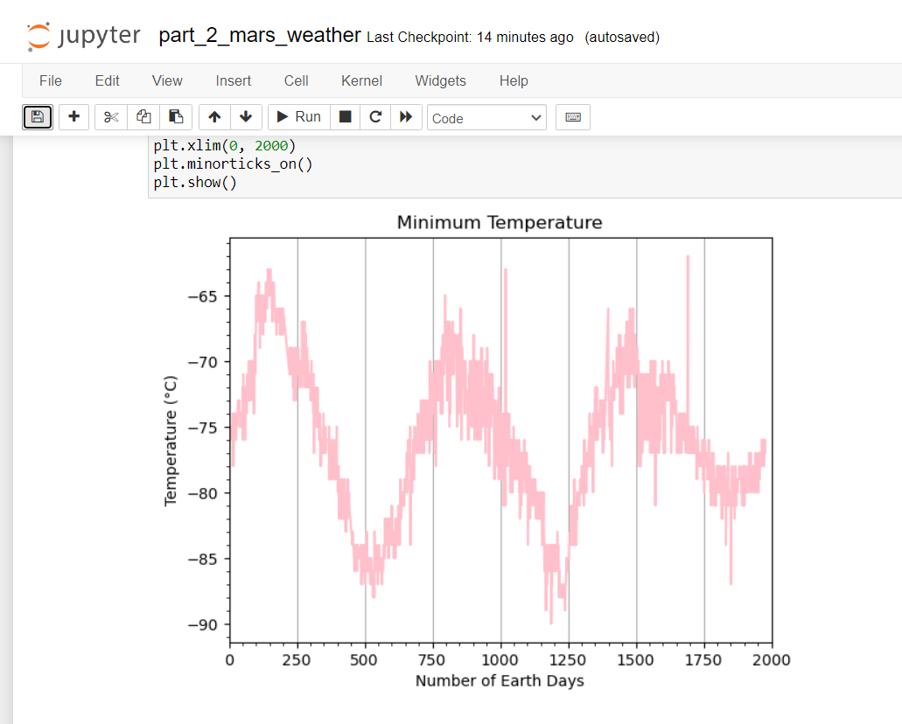

# scraping-challenge

# Deliverables:

# Deliverable 1: Scrape titles and preview text from Mars news articles.
    Open the Jupyter Notebook in the starter code folder named part_1_mars_news.ipynb. You will work in this code as you follow the steps below to scrape the Mars News website.

# Deliverable 2: Scrape and analyze Mars weather data, which exists in a table.
    Open the Jupyter Notebook in the starter code folder named part_2_mars_weather.ipynb. You will work in this code as you follow the steps below to scrape and analyze Mars weather data.

# Solution
Part 1 - mars_news.ipynb scrapes news headlines and preview text from  the Mars news site.

Part 2 - mar_weather.ipynb scrapes weather data and stores information in a dataframe and csv file. Analysis and findings are noted in markdown cells throughout notebook.

